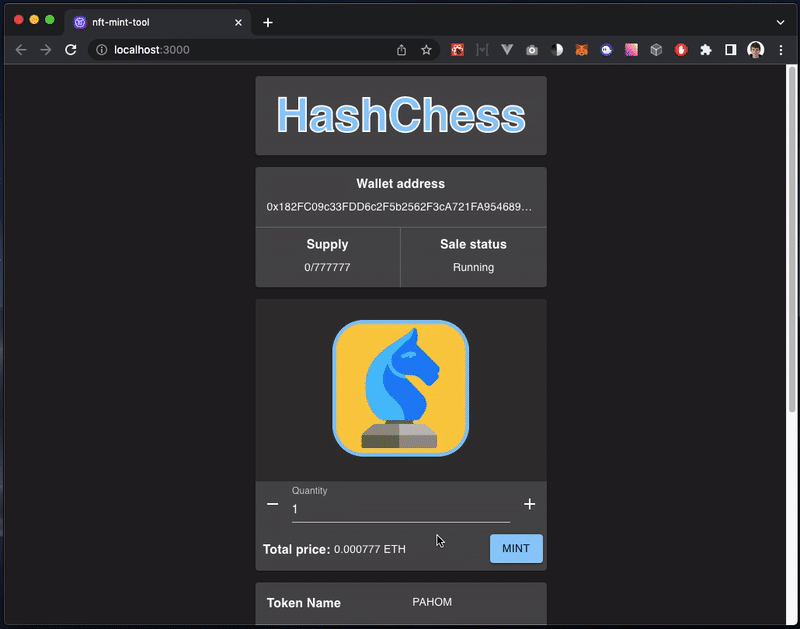

# nft-mint-tool

> [ERC721A](https://github.com/chiru-labs/ERC721A) smart contract build for [Remix-IDE](https://github.com/ethereum/remix-ide) based deployment

This tool supports multiple mint waves and [merkle tree whitelist](https://medium.com/@ItsCuzzo/using-merkle-trees-for-nft-whitelists-523b58ada3f9) for a presale

## Contribute

> [!IMPORTANT]
> There is made by using [react-declarative](https://github.com/react-declarative/react-declarative) to solve your problems. **⭐Star** and **💻Fork** It on github will be appreciated

## Screencast

## Setup guide

1. Run `npm run start:ganache` in separated terminal
2. Run `npm run deploy:contracts` to deploy contracts to ganache
3. Run this DApp by running `npm start` in [client](./packages/client) folder. Send some tokens
4. Connect local client to MetaMask with deployer account. Enable mint by running `ioc.contractService._instance.setPaused(false)` or `ioc.contractService.updateWhiteList().then(() => ioc.contractService._instance.setWhitelistMintEnabled(true))` in Chrome Dev Tools on local client instance **(npmstart-ed)**

## Keywords

SOLID, DI, OOP, WEB3, Ethers.js, React, TypeScript
